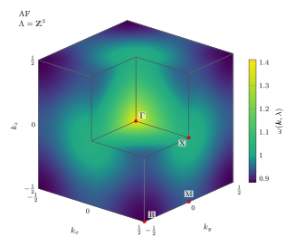

<h1 align="center">
  <picture>
    <source media="(prefers-color-scheme: dark)" srcset="docs/logo/gzl-logo-wide-dark.svg" />
    
  </picture>
</h1>

[](https://github.com/graph-zeta/gzl/actions/workflows/ci.yml?query=branch%3Amain)
[](https://arxiv.org/abs/2609.18918)
[](https://arxiv.org/abs/2609.18761)
[](LICENSE)

Author: Andreas A. Buchheit

Contact: andreas.buchheit@uni-saarland.de, [buchheit-research.org](https://buchheit-research.org)

Dear Visitor, welcome to the Graph Zeta Library!

This library permits the efficient and precise evaluation of the high-dimensional oscillatory lattice sums appearing in high-order linked-cluster expansions of quantum lattice models based on graph zeta functions. For state-of-the-art series expansions, it replaces cluster-scale Monte Carlo runs with precise evaluations within minutes on standard desktop hardware. In addition, it allows one to resolve the full Brillouin zone grid at the cost of a single momentum evaluation, providing access to finely resolved dispersion relations. Supported are general 1D, 2D, and 3D lattices and power-law interactions accompanied by short-ranged terms. Regarding models, we currently provide the graphs and prefactors for the long-range transverse-field Ising model (LRTFIM, order 13 for 0qp and order 11 for 1qp). The method is general and additional default models, such as the Heisenberg model, will be included as time progresses.

GZL evaluates each graph lattice sum, called a graph zeta function if power-law kernels are involved, by first factorizing it over blocks. Each block is then evaluated by the cheapest available strategy depending on its treewidth tw, while exploiting redundancies through caching. Basic blocks, such as bridges and cycles, admit analytic forms in terms of generalized zeta functions. Series-parallel blocks with tw ≤ 2 are computed at linear cost in the number of graph nodes and log-linear cost in the size of the momentum grid using a semi-analytical algebra based on Epstein zeta functions and rapidly decaying Fourier series. This makes accurate evaluation possible even for exponents close to the spatial dimension *d*. Finally, blocks with tw > 2 are evaluated by tensor-network bucket elimination, yielding polynomial scaling of numerical work and memory in momentum grid size with exponents only growing with tw rather than with the number of vertices. Through use of FFT, the full momentum-dependent single-particle excitation is recovered on a momentum grid at the cost of a single momentum evaluation, where Monte Carlo methods would require one run per momentum.

For all details on the numerical method, including the proofs, as well as numerical benchmarks, see [arXiv:2609.18918](https://arxiv.org/abs/2609.18918). The method is integrated into linked-cluster perturbation theory in [arXiv:2609.18761](https://arxiv.org/abs/2609.18761), including a detailed study of the long-range transverse-field Ising model (LRTFIM), with dispersion relations for different microscopic interaction models for the 3D quantum magnet KTmSe₂.

## Installation

GZL requires Python 3.11 or newer and is available on PyPI via

```bash
pip install gzl
```

From a clone of this repository, the library can be installed in editable mode:

```bash
pip install -e .
```

Either installation puts the `gzl` command on the path, whose subcommands are listed by `gzl --help`. `gzl selftest` checks an installation against the shipped data and against values whose answers are known independently, and `gzl info` prints the versions and paths a bug report needs.

Both installations include the full runtime stack consisting of [NumPy](https://numpy.org/), [SciPy](https://scipy.org/), [EpsteinLib](https://pypi.org/project/epsteinlib/), [NetworkX](https://networkx.org/), and [h5py](https://www.h5py.org/), which permits the direct use of the `evaluate_graph` front-end and of the corpus loaders. As EpsteinLib is built from source during installation, a C compiler is required on Linux and macOS (e.g. via the Command Line Tools).

The `[dev]` extra adds `pytest`, `pytest-xdist` and `mpmath` for running the test suite:

```bash
pip install -e ".[dev]"
```

The tests are then run from the root of the repository via

```bash
pytest -v
```

Long-running stability sweeps are skipped by default and can be included via `pytest --runslow`.

The TFIM graph corpora and the Monte Carlo reference series are shipped within the package. Details are given in [Shipped reference data](DOCUMENTATION.md#shipped-reference-data).

## Basic example

The series coefficients of the one-quasiparticle gap of the LRTFIM on the cubic lattice, for ν = 4 up to order 9, are obtained over the whole Brillouin zone by

```python
from gzl import compute_series_coefficients

corpus   = "tfim1qp"   # or "tfim0qp" for the ground-state series
A        = "cubic"     # or "chain", "square", "triangular", or an np.array
nu       = 4.0         # a float, an array (a sweep), or an Interaction
n_points = 8           # Brillouin-zone grid points per dimension

res = compute_series_coefficients(corpus, nu, A, n_points, order_max=9)
for order, value in res.items():
    print(order, value[0, 0, 0])       # k = 0
```

within seconds on a single core. Each coefficient is an array over the Brillouin-zone grid, of which the example prints the zero-momentum component. A single ν carries no further axis. A sweep, `nu = [3.5, 4.0]`, prepends one. The coefficients agree with the Monte Carlo values of S. Fey, [PhD thesis, FAU Erlangen-Nürnberg (2020)](https://open.fau.de/handle/openfau/13818), Table F.10, within their statistical errors.

The same coefficients are obtained from the command line by

```bash
gzl series --corpus tfim1qp --A cubic --nu 4 --n-points 8 \
           --order-max 9 --output coefficients.csv
```

which writes one row per order and Brillouin-zone grid point to `coefficients.csv`. The rows with `k_index` 0 hold the zero-momentum values printed above.

<p align="center">
  <picture>
    <source media="(prefers-color-scheme: dark)" srcset="docs/figures/cutaway_afm_dark.svg" />
    
  </picture>
  <br />
  <em>Dispersion relation for an antiferromagnetic coupling λ = −0.03 at higher order r = 10 and finer resolution with 16³ = 4096 momentum points, requiring approximately 10 minutes on a single core (taken from <a href="https://arxiv.org/abs/2609.18918">arXiv:2609.18918</a>).</em>
</p>

## Quick start

### Definition of the graph zeta function

Let $G = (V, E, \nu, s, t)$ be a finite multigraph with two
distinguished terminal vertices $s, t \in V$, per-edge exponents
$\nu : E \to \mathbb{R}^+$, and each edge oriented as
$e = (e^-, e^+)$. On a $d$-dimensional Bravais lattice
$\Lambda = A\mathbb{Z}^d$ generated by the columns of
$A \in \mathbb{R}^{d \times d}$, define the regularised interaction
kernel

```math
\mathcal{K}_{\nu}:\Lambda\to\mathbb{R},\qquad \mathcal{K}_{\nu}(\boldsymbol{x})=\lvert\boldsymbol{x}\rvert^{-\nu}\quad\text{for}\quad \boldsymbol{x}\neq\boldsymbol{0},
```
and $\mathcal{K}_{\nu}(\boldsymbol{x})=0$ for $\boldsymbol{x}=\boldsymbol{0}$,
which sets the coincident-point self-interaction to zero. More
generally an edge may carry a general interaction

```math
K(\boldsymbol{x})=a(\boldsymbol{x})+\sum_j b_j\,\mathcal{K}_{\nu_j}(\boldsymbol{x}),
```

a finite sum of regularised power laws plus a real, even,
compactly supported short-range part $a$ (a function of the
displacement vector, so it may be anisotropic, and $a(\boldsymbol{0})$ is
allowed and simply weights configurations whose two endpoints
coincide). Every front-end accepts such an `Interaction` wherever it
accepts $\nu$. See [General interactions](DOCUMENTATION.md#general-interactions).
Denote by $K_e$ the interaction on edge $e$, so that
$K_e = \mathcal{K_{\nu_e}}$ for a power law. The graph zeta function
of $G$ at momentum $\boldsymbol{k} \in \mathbb{R}^d$ is

```math
\zeta_G(\boldsymbol{k})=\sum_{\{\boldsymbol{x}_v\in\Lambda\}_{v\neq p}} \mathrm{e}^{-2\pi\mathrm{i}\,(\boldsymbol{x}_t-\boldsymbol{x}_s)\cdot\boldsymbol{k}} \prod_{e\in E}\mathcal{K}_{\nu_e}\!\bigl(\boldsymbol{x}_{e^+}-\boldsymbol{x}_{e^-}\bigr),
```

where the sum runs over all $\boldsymbol{x}_v \in \Lambda$ for
$v \in V \setminus \lbrace p \rbrace$, with an arbitrary pin $p \in V$ held
fixed. By translational invariance $\zeta_G$ is independent of the
choice of pin, and we set $\boldsymbol{x}_p = \boldsymbol{0}$ in the
following. The displacement of $t$ from $s$ is conjugate to
$\boldsymbol{k}$ through the Fourier kernel, so $\zeta_G$ is the
lattice Fourier transform of the two-point correlator with respect to
that displacement. A sufficient condition for absolute convergence is
$\mathrm{Re}(\nu_e) > d$ on every edge for pure power laws or summability of $K_e$ for the more general case.

### Evaluating a single graph zeta

A direct evaluation of the $\lvert V \rvert - 1$ iterated lattice sums requires $\mathcal{O}(n^{(\lvert V \rvert - 1)d})$ arithmetic operations on an $n^d$ grid and is therefore infeasible beyond a few vertices. The library function `evaluate_graph` instead reduces $\zeta_G$ through three exact steps.

**1. Hadamard merge.** Parallel edges between the same pair of
vertices share one displacement, and the kernel is multiplicative in
its exponent,

```math
\mathcal{K}_{\nu}(\boldsymbol{x})\,\mathcal{K}_{\nu'}(\boldsymbol{x})=\mathcal{K}_{\nu+\nu'}(\boldsymbol{x}),
```

so a bundle of parallel edges with exponents $\nu_1,\dots,\nu_m$
collapses to a single edge of exponent $\nu_1+\cdots+\nu_m$, turning
the multigraph into a simple weighted graph with the same $\zeta_G$.
For general interactions the bundle kernel is the pointwise product
$\prod_e K_e(\boldsymbol{x})$. The class is closed under it, since
compact parts multiply into compact parts, power laws add their
exponents, and the cross terms are compactly supported. The library
keeps the product lazy and samples it exactly wherever an engine needs
the kernel. Only the planner reads the summed tail exponents.

**2. Block-cut decomposition.** Each edge lies in exactly one
biconnected block of the merged simple graph, and two blocks share at
most one (cut) vertex, so at zero momentum the lattice sum factorises
over the blocks $B$,

```math
\zeta_G(\boldsymbol{0})=\prod_{B}\zeta_B(\boldsymbol{0}),
```

each $\zeta_B(\boldsymbol{0})$ being the block evaluated as its own
graph zeta. At finite $\boldsymbol{k}$ only the blocks on the path
from $s$ to $t$ in the block-cut tree (the spine) carry the
momentum, while off-spine blocks keep their zero-momentum value,

```math
\zeta_G(\boldsymbol{k})=\Bigl(\prod_{B\ \text{off-spine}}\zeta_B(\boldsymbol{0})\Bigr)\prod_{B\ \text{on-spine}}\zeta_B(\boldsymbol{k};s_B,t_B),
```

with $(s_B, t_B)$ the entry and exit cut vertices of each spine block.
A full Brillouin-zone dispersion therefore costs essentially one block
evaluation.

**3. Per-block evaluation.** Each block is evaluated by the cheapest exact method for its topology, a closed form for bridges and simple cycles, the semi-analytical algebra or the tensor evaluator for treewidth-2 blocks, and the torus tensor network for treewidth $\ge 3$, selected by the router described under [`evaluate_graph`](DOCUMENTATION.md#single-graph-front-end-evaluate_graph). 
Graphs built entirely from bridges and simple cycles evaluate fully analytically, touching no grid. The total cost is linear in $\lvert V \rvert$ for
bounded block size.

### Evaluating a corpus

High-order perturbative series are prefactor-weighted sums of graph zeta functions over a corpus, a collection of combinatorial multigraphs $G$ carrying topology, integer edge multiplicities, a prefactor
$a_r(G)$, and (for single-particle graphs) terminals $(s, t)$, but no exponents or interaction kernels. A scalar coupling exponent $\nu$, or a general `Interaction` $K$, promotes each $G$ to a graph zeta $(G, \mathcal{K_\nu})$ by assigning it to every edge. 
An edge of multiplicity $m$ is $m$ parallel edges, which merge to effective exponent $m\nu$ (or to the pointwise power $K^m$). The coefficient at
order $r$ is

```math
c_r(\boldsymbol{k})=\sum_{G\in\mathcal{C_r}}a_r(G)\,\zeta_{(G,\mathcal{K_\nu})}(\boldsymbol{k}),
```

so its $\nu$- and $\boldsymbol{k}$-dependence enters only through this assignment.

The corpora shipped with GZL are those of the long-range transverse-field Ising model (LRTFIM), including both the zero-quasiparticle (0qp) and one-quasiparticle (1qp) sectors. In units of the bare gap $2h$, the associated Hamiltonian reads

```math
H=\sum_{\boldsymbol{x}\in\Lambda}\frac{1}{2}\sigma^{x}_{\boldsymbol{x}}-\frac{\lambda}{2}\sum_{\substack{\boldsymbol{x},\boldsymbol{y}\in\Lambda\\ \boldsymbol{x}\neq\boldsymbol{y}}}K(\boldsymbol{x}-\boldsymbol{y})\,\sigma^z_{\boldsymbol{x}}\sigma^z_{\boldsymbol{y}},
```

with $h > 0$ the transverse field, $\lambda = J/(2h)$ the ratio of the
coupling constant $J$ to the bare gap, and $K$ an even kernel, taken as
$\mathcal{K_\nu}$ for a power law. The coupling is ferromagnetic for
$\lambda > 0$ and antiferromagnetic for $\lambda < 0$. We provide corpora for the Taylor series of two observables in $\lambda$ around zero, namely the ground-state energy density
$e_0$ over the 0qp corpus and the one-quasiparticle dispersion relation $\omega$ over the 1qp corpus,

```math
e_0(\lambda)=-\frac{1}{2}+\sum_{r=2}^{\infty}c_r\,\lambda^{r},
\qquad
\omega(\boldsymbol{k},\lambda)=1+\sum_{r=1}^{\infty}c_r(\boldsymbol{k})\,\lambda^{r}.
```

Both zero-order terms are fixed by the normalisation rather than computed. Neither requires a lattice sum, so the order $r = 0$ graph is not included in the corpus, and `compute_series_coefficients` returns only $r \ge 1$. The order $1$ term of the energy density vanishes as well, which is why that series starts at $r = 2$. Adding the constant back is left to the caller.

The corpus stores combinatorial data alone and is
therefore dimension-agnostic. The lattice $\Lambda$, its dimension
$d$, the discretisation, and the exponent or interaction kernel all enter at evaluation, so
one corpus drives every $(\Lambda, d, \nu)$. Because block factorisation makes identical blocks recur across thousands of graphs, an isomorphism-verified block cache evaluates each distinct block once per corpus pass. `compute_series_coefficients` evaluates this coefficient $c_r$, while `evaluate_corpus` exposes the per-graph values $\zeta_{(G,\mathcal{K_\nu})}$ it sums (the embedding factors, before the prefactor weighting).

The library presents three front-ends, in increasing scope.
`evaluate_graph` evaluates a single graph zeta
$\zeta_G(\boldsymbol{k})$. `evaluate_corpus` returns the per-graph
value of every graph in a corpus. `compute_series_coefficients`
assembles those per-graph values into the perturbative-series
coefficients $c_r(\boldsymbol{k})$. The naming is chosen such that
the `evaluate_*` functions return graph-zeta *values* while
`compute_series_coefficients` assembles the derived series.


For an extensive discussion of all front-ends, general interaction kernels,
the worked examples, the engines and the full API reference, see
[DOCUMENTATION.md](DOCUMENTATION.md).

## License

`gzl` is licensed under the **GNU Affero General Public License,
version 3 or later** (AGPL-3.0-or-later). See [`LICENSE`](./LICENSE) for the
full text.

AGPL § 13 (network-use clause) requires anyone who modifies `gzl` and runs
the modified version as a network service to make its complete
corresponding source code available to all users of that service.

The third-party reference data in `gzl/data/` is not covered by the
AGPL, and its sources and terms are listed in [`NOTICE`](./NOTICE).

## Contributing

Pull requests are welcome. For non-trivial changes, please open an issue first to discuss the design. Contributions are licensed under the [MIT License](https://opensource.org/license/mit) as well as AGPL-3.0-or-later, and opening a pull request constitutes agreement to that. Contributors should sign their commits with the [Developer Certificate of Origin](https://developercertificate.org/) (`git commit -s`).

See [`CONTRIBUTING.md`](./CONTRIBUTING.md) for the full workflow, code
style, and bug-report guidelines.

## How to cite

Dear User, if you enjoyed using GZL, please give it a star and tell your colleagues and friends about it. If you did not, please send us a message so that we can improve it.

When using GZL in published work, please cite it as given in [`CITATION.cff`](./CITATION.cff), which GitHub also offers under "Cite this repository". The relevant papers on graph zeta functions are [[1]](#references) and [[2]](#references), and the numerical articles underlying its main dependency EpsteinLib are [[10]](#references) and its recent anisotropic extension [[12]](#references).

## Acknowledgements

I am grateful to Jan Koziol for the inspiring discussions that initiated this work, and to Kai Phillip Schmidt and his group, including Antonia Duft, Patrick Adelhardt and Jan Koziol, for their time and support and for their work on the physical application of this method. I especially thank Antonia Duft for library testing and bug reports. I am grateful to Torsten Keßler, Andreas Rupp, and Kirill Serkh for helpful discussions. I am grateful to Patrick Klitzke for introducing me to AI-assisted specification-driven development.

I gratefully acknowledge support by the Klaus-Tschira Stiftung under Grant No. 00.025.2025.

Claude Code (using models Opus 4.8, Opus 5, Fable 5, Fable 5.1, Opus 5.5) was used in the development of the Graph Zeta Library and its documentation. I verified all results.

## References

#### Graph zeta functions

[1] A. A. Buchheit and A. Rupp. "Graph lattice sums and graph zeta functions for long-range interacting quantum lattice models". [arXiv:2609.18918](https://arxiv.org/abs/2609.18918) (2026).  
[2] A. Duft, P. Adelhardt, J. A. Koziol, A. A. Buchheit, and K. P. Schmidt. "Exact and fast series expansions for quantum models with long-range interactions". [arXiv:2609.18761](https://arxiv.org/abs/2609.18761) (2026).

#### Linked-cluster expansions

[3] K. Coester and K. P. Schmidt. "Optimizing linked-cluster expansions by white graphs". [Phys. Rev. E **92**, 022118](https://doi.org/10.1103/PhysRevE.92.022118) (2015).  
[4] S. Fey and K. P. Schmidt. "Critical behavior of quantum magnets with long-range interactions in the thermodynamic limit". [Phys. Rev. B **94**, 075156](https://doi.org/10.1103/PhysRevB.94.075156) (2016).  
[5] P. Adelhardt, J. A. Koziol, A. Langheld, and K. P. Schmidt. "Monte Carlo based techniques for quantum magnets with long-range interactions". [Entropy **26**, 401](https://doi.org/10.3390/e26050401) (2024).

#### Computation of generalized Epstein zeta functions

[6] P. Epstein. "Zur Theorie allgemeiner Zetafunctionen". [Math. Ann. **56**, 615-644](https://doi.org/10.1007/BF01444309) (1903).  
[7] P. Epstein. "Zur Theorie allgemeiner Zetafunktionen. II". [Math. Ann. **63**, 205-216](https://doi.org/10.1007/BF01449900) (1906).  
[8] R. E. Crandall. "Unified algorithms for polylogarithm, L-series, and zeta variants". Algorithmic Reflections: Selected Works, PSI Press (2012).  
[9] A. A. Buchheit, T. Keßler, and K. Serkh. "On the computation of lattice sums without translational invariance". [Math. Comp. **94**, 2533-2574](https://doi.org/10.1090/mcom/4024) (2025).  
[10] A. A. Buchheit, J. K. Busse, and R. Gutendorf. "Computation and properties of the Epstein zeta function with applications to quantum systems". [IMA J. Numer. Anal., drag057](https://doi.org/10.1093/imanum/drag057) (2026).  
[11] A. A. Buchheit and J. K. Busse. "Epstein zeta method for many-body lattice sums". [Numer. Math.](https://doi.org/10.1007/s00211-026-01558-y) (2026).  
[12] A. A. Buchheit and J. K. Busse. "Computation of anisotropic singular sums from high-order derivatives of Epstein zeta functions". [arXiv:2609.28282](https://arxiv.org/abs/2609.28282) (2026).

#### Singular Euler-Maclaurin expansion

[13] A. A. Buchheit and T. Keßler. "On the efficient computation of large scale singular sums with applications to long-range forces in crystal lattices". [J. Sci. Comput. **90**, 53](https://doi.org/10.1007/s10915-021-01731-5) (2022).  
[14] A. A. Buchheit and T. Keßler. "Singular Euler-Maclaurin expansion on multidimensional lattices". [Nonlinearity **35**, 3706-3754](https://doi.org/10.1088/1361-6544/ac73d0) (2022).  
[15] A. A. Buchheit, T. Keßler, P. K. Schuhmacher, and B. Fauseweh. "Exact continuum representation of long-range interacting systems and emerging exotic phases in unconventional superconductors". [Phys. Rev. Res. **5**, 043065](https://doi.org/10.1103/PhysRevResearch.5.043065) (2023).

#### Theoretical chemistry

[16] A. Robles-Navarro, S. Cooper, A. A. Buchheit, J. K. Busse, A. Burrows, O. Smits, and P. Schwerdtfeger. "Exact lattice summations for Lennard-Jones potentials coupled to a three-body Axilrod-Teller-Muto term applied to cuboidal phase transitions". [J. Chem. Phys. **163**, 094104](https://doi.org/10.1063/5.0276677) (2025).
